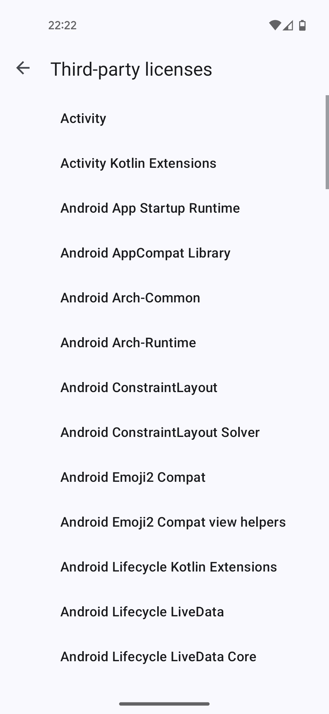
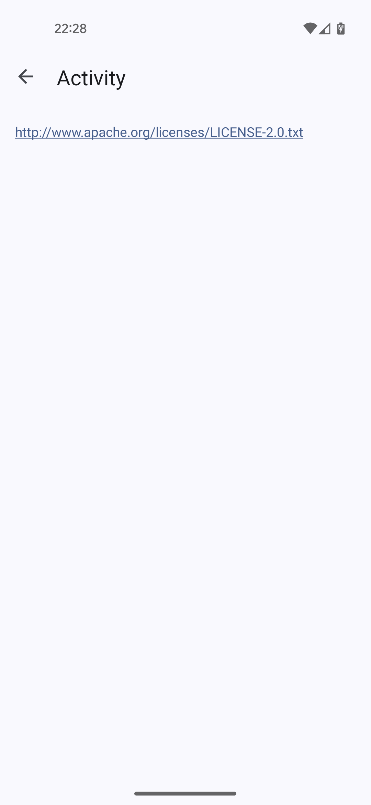
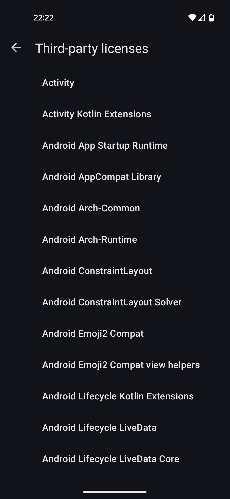
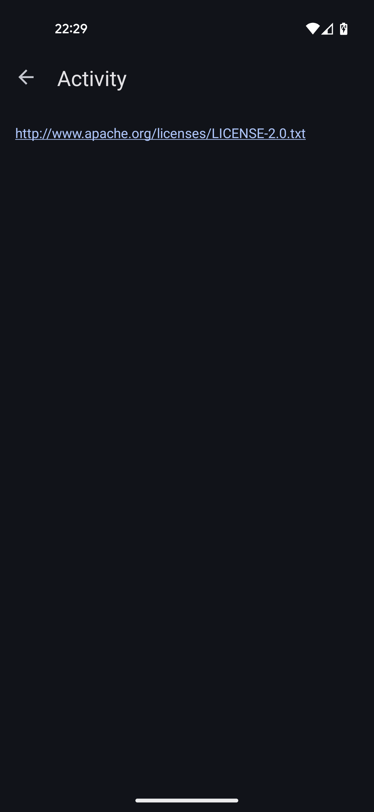

# OssLicensesParser


### Parser for the text files generated by the OSS Licenses Gradle Plugin

This project is intended to offer a parser for the text files generated by the
[OSS Licenses Gradle Plugin](https://github.com/google/play-services-plugins/tree/master/oss-licenses-plugin).
The parsed data can then be used to display license information in your Android application.

The OSS Licenses Gradle Plugin gathers the licenses of libraries contained in your Android application at compile time.
There is also the
[play-services-oss-licenses](https://github.com/google/play-services-plugins/tree/master/oss-licenses-plugin#displaying-license-information)
library to display these information.
But while the plugin is open-source software developed under the Apache-2.0 license the library is not.
It is closed-source published under the Android Software Development Kit License.
Therefore, the closed-source library should not be used in open-source Android applications.

Instead, you can use this parser and build your own UI to display the license information.

## Getting Started

Add the OSS Licenses Gradle Plugin as described in their
[documentation](https://github.com/google/play-services-plugins/tree/master/oss-licenses-plugin#add-the-gradle-plugin).
Then add the OssLicensesParser dependency.

```kotlin
dependencies {
    implementation("de.philipp-bobek:oss-licenses-parser:1.0.0")
}
```

You can either parse the metadata separately and then parse a specific license content on demand like so:

```kotlin
val thirdPartyLicenseMetadataFile = context.resources.openRawResource(R.raw.third_party_license_metadata)
val licenseMetadataList = OssLicensesParser.parseMetadata(thirdPartyLicenseMetadataFile)
licenseMetadataList.forEach { licenseMetadata -> println("Library: ${licenseMetadata.libraryName}") }

// ...

val licenseMetadata = licenseMetadataList.first()
val thirdPartyLicensesFile = context.resources.openRawResource(R.raw.third_party_licenses)
val license = OssLicensesParser.parseLicense(licenseMetadata, thirdPartyLicensesFile)
println("First license and its content: ${license.libraryName} - ${license.licenseContent}")
```

Or you can parse all licenses in one go:

```kotlin
val thirdPartyLicenseMetadataFile = context.resources.openRawResource(R.raw.third_party_license_metadata)
val thirdPartyLicensesFile = context.resources.openRawResource(R.raw.third_party_licenses)
val licenses = OssLicensesParser.parseAllLicenses(thirdPartyLicenseMetadataFile, thirdPartyLicensesFile)
licenses.forEach { license -> println("License: ${license.libraryName} - ${license.licenseContent}") }
```

## Example

For a real life example see the
[ThirdPartyLicensesFragment](https://github.com/Kr0oked/Compass/blob/0b9f0bbe6137179129c9eba99497289bf54a4c17/app/src/main/java/com/bobek/compass/ThirdPartyLicensesFragment.kt)
from the [Compass](https://github.com/Kr0oked/Compass) app.
There the third-party licenses get displayed in a preference fragment.







## License

The project is licensed under the GNU Lesser General Public License v3.0.
You can find the license text in the [LICENSE](LICENSE) file.
